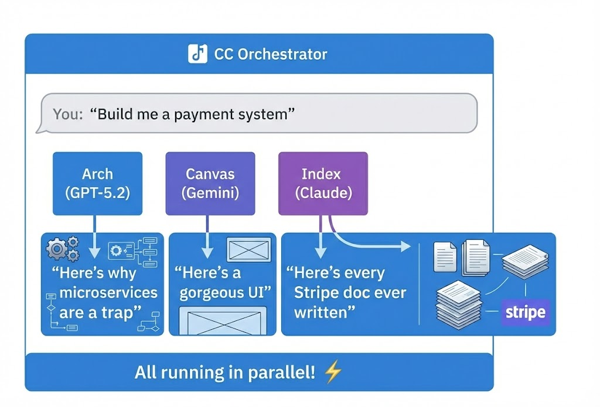

# CC Orchestrator

[](https://opensource.org/licenses/MIT)
[](https://www.npmjs.com/package/cc-orchestrator)

**[English Documentation](./README.md)**

> *"AI 하나로 버티지 말고, 오케스트라를 소환해서 코드 앞에서 싸우게 하자"*

**CC Orchestrator**는 coding agent CLI를 위한 runtime-first 오케스트레이션 엔진입니다. 메인 coding agent가 이 도구를 설치하고, 사용 가능한 서브 에이전트 CLI를 발견한 뒤, MCP 도구를 통해 세션을 시작하고, 컨텍스트를 전달하고, 구조화된 토론을 돌리고, 다음 액션으로 결과를 통합합니다.

---

## 🎭 왜 필요한가

상상해보세요: 메인 coding agent는 방향을 잘 잡지만, 실제 설계나 구현 전에 다른 agent CLI들에게 검증과 반론을 받고 싶습니다.

**CC Orchestrator**의 제안: *"메인 agent가 다른 agent CLI 세션을 띄우고, 서로 토론시키고, 누가 어떤 근거를 냈는지 추적하면 어떨까요?"*

<p align="center">
  
</p>

[Oh My OpenCode](https://github.com/code-yeongyu/oh-my-opencode)에서 아이디어를 ~~훔쳐~~영감을 받았습니다. 현재 리라이트는 MCP를 첫 번째 host adapter로 유지하되, 오케스트레이션 코어 자체는 특정 호스트에 종속되지 않도록 재구축하는 방향입니다.

---

## ✨ 주요 기능 (쓸모있는 것들)

### 🎯 메인 에이전트 / 서브 에이전트 세션

핵심 단위는 더 이상 "모델 API에 프롬프트 하나 보내기"가 아닙니다. "coding agent CLI 위에서 세션을 시작하고, 계속 대화하기"입니다.

- 메인 에이전트가 서브 에이전트 세션을 시작
- 각 세션은 transcript, artifact, 상태를 유지
- 세션은 후속 메시지로 다시 이어질 수 있음
- 오케스트레이터는 일회성 결과가 아니라 세션 그래프를 관리

### 🧠 capability-first 라우팅

새 런타임은 hard-coded persona 대신 capability 기준으로 세션을 선택합니다.

- `planning`
- `implementation`
- `codebase_search`
- `patch_edit`
- `shell_execution`
- `multi_turn_chat`
- `debate_participation`
- `stance_simulation`

### 🗣️ 구조화된 토론

핵심은 병렬 실행 자체보다 "검증"입니다.

```text
작성 세션          → 초안 생성
리뷰 세션들        → 반박 / 보완 / 거절
내부 스탠스 시뮬레이션 → 회의론자 / 구현자 / 리뷰어
최종 산출물        → 합의안 + 이견 + 근거
```

### 🔌 MCP는 첫 번째 host adapter

MCP는 여전히 메인 에이전트가 이 오케스트레이터를 호출하는 가장 현실적인 첫 인터페이스입니다. 하지만 이제 MCP가 제품 그 자체는 아닙니다.

- 오케스트레이션 코어는 `src/core/`
- MCP는 `src/server/`
- 이후 다른 host adapter를 추가해도 core는 유지

---

## 🚀 설치

### 현재 리라이트 상태

저장소는 runtime-first 재구축 중입니다. 상단의 제품 방향은 확정됐지만, 아래 일부 섹션은 아직 교체 중인 레거시 provider 기반 구현을 설명합니다. 해당 부분은 마이그레이션 노트로 읽어주세요.

### 레거시 노트

이 README 아래쪽의 일부 내용은 현재 교체 대상인 구현을 설명합니다. 기여자가 마이그레이션 대상 코드를 이해할 수 있도록 잠시 남겨둡니다.

---

## 🎮 사용법

### 멀티 에이전트 오케스트레이션

메인 진입점입니다. Claude Code가 복잡한 작업을 위해 여러 AI 에이전트를 조율합니다.

```bash
/orchestrate JWT로 사용자 인증 구현해줘
```

오케스트레이터가:
1. 요청을 분석하고 단계별로 분해
2. 각 단계에 최적의 에이전트 선택 (arch, canvas, index 등)
3. 가능하면 에이전트를 병렬로 실행
4. 결과를 수집하고 통합

### 단일 에이전트 사용

한 명의 전문가만 필요한 간단한 작업용.

**네이티브 에이전트 (무료)** - Claude Code 할당량으로 실행:

```bash
# Scout로 코드베이스 탐색 (Haiku)
"Use scout agent to find all authentication-related files"

# Index로 외부 리서치 (Sonnet + WebSearch)
"Use index agent to find Express middleware best practices"
```

**MCP 에이전트 (외부 API)** - API 키 필요:

```bash
# Arch로 아키텍처 리뷰 (GPT-5.2)
"Use arch agent to review this payment system architecture"

# Canvas로 UI/UX 디자인 (Gemini)
"Use canvas agent to design a login page component"

# Quill로 문서화 (Gemini)
"Use quill agent to write API docs for this module"

# Lens로 이미지 분석 (Gemini)
"Use lens agent to analyze this wireframe screenshot"
```

### 추가 스킬

**UI 품질 검증:**
```
/ui-qa                              # 개발 서버 자동 감지
/ui-qa http://localhost:3000        # 특정 URL 테스트
```

스크린샷 촬영, AI 분석, 시각적 문제, 접근성 이슈, 레이아웃 버그 리포트.

**컨텍스트 체크포인트:**
```
/checkpoint "인증 시스템 완료, JWT 방식 선택"
```

대화 컨텍스트 저장. `/compact` 후에도 살아남음. 컨텍스트 잃어버리는 건 아프니까.

### 직접 도구 호출 (컨트롤 프릭용)

```javascript
// 에이전트를 허공으로 발사
background_task({ agent: "arch", prompt: "내 인생 선택을 판단해줘 (코드 관련으로)" })

// 아직 생각 중인지 확인
background_output({ task_id: "abc123", block: false })

// 답을 요구
background_output({ task_id: "abc123", block: true })

// 지겨울 때 취소
background_cancel({ task_id: "abc123" })  // 하나만 취소
background_cancel({ all: true })          // 전부 취소

// 작업 목록 조회
list_tasks({ filter: { status: ["running"] } })

// 에이전트 간 컨텍스트 공유
share_context({ key: "api_research", value: { findings: "..." } })
get_context({ key: "api_research" })

// 에이전트 추천 받기
suggest_agent({ query: "이 아키텍처 리뷰해줘" })
```

### AST 기반 코드 검색 (스마트한 방법)

grep은 잊어요. 텍스트가 아닌 구조로 코드를 검색하세요.

```javascript
// 모든 console.log 호출 찾기
ast_search({ pattern: "console.log($MSG)", path: "./src" })

// 모든 함수 선언 찾기
ast_search({ pattern: "function $NAME($$$ARGS) { $$$BODY }", path: "./src" })

// 모든 if 문 찾기
ast_search({ pattern: "if ($COND) { $$$BODY }", path: "./src" })

// var를 const로 바꾸기 (미리보기 먼저)
ast_replace({
  pattern: "var $NAME = $VAL",
  replacement: "const $NAME = $VAL",
  path: "./src",
  dry_run: true
})
```

TypeScript, JavaScript, Python, Rust, Go, Java 등 지원.

---

## 💡 프로 팁

### 1. 네이티브 에이전트는 공짜. 맘껏 써도 됨

`scout`와 `index` 에이전트는 `.claude/agents/`에 살면서 Claude Code 할당량만 씀. 추가 API 비용 0원.

```bash
"scout 에이전트로 인증 관련 파일 다 찾아줘"
"index 에이전트로 JWT 베스트 프랙티스 찾아줘"
```

이럴 때 좋음:
- "그 파일 어디 있어?" → `scout`
- "이 라이브러리 어떻게 써?" → `index`
- "프로젝트 구조 보여줘" → `scout`

### 2. Arch는 비쌈. 현명하게 쓸 것

GPT-5.2는 존재론적 위기당 과금됨. 이럴 때만 쓰세요:
- 어차피 나중에 후회할 아키텍처 결정
- 잠 못 들게 하는 보안 리뷰
- 버그 3번 고쳐봤는데 이제 개인적인 감정이 생겼을 때

### 3. 뭐든 병렬화

이렇게 말고:
```
"API 조사하고, 그 다음 컴포넌트 디자인하고, 그 다음 리뷰해"
```

이렇게:
```
"scout로 기존 패턴 찾아줘"              // 무료 (Haiku)
"index로 Stripe 문서 찾아줘"          // 무료 (WebSearch)
background_task(arch, "보안 리뷰해줘...")  // GPT-5.2
```

네이티브 + MCP 에이전트. 병렬 실행. 최대 효율.

---

## 🔧 설정

### 프로바이더 우선순위

누가 먼저 호출될지 `~/.cco/config.json`에서 커스터마이징:

```json
{
  "providers": {
    "priority": ["anthropic", "google", "openai"]
  },
  "roles": {
    "arch": {
      "providers": ["openai", "anthropic"]
    }
  }
}
```

### 환경 변수

```bash
# "Anthropic 먼저, 그 다음 Google, 그 다음 OpenAI"
export CCO_PROVIDER_PRIORITY=anthropic,google,openai

# "Arch는 특별히 OpenAI 먼저, 그 다음 Anthropic"
export CCO_ARCH_PROVIDERS=openai,anthropic

# "나 인내심 있음" (타임아웃, 초 단위)
export CCO_TIMEOUT_SECONDS=300
```

---

## 📦 프로젝트 구조

```text
cc-orchestrator/
├── .claude/                # Claude Code 네이티브 설정
│   └── agents/             # 네이티브 에이전트 (무료, API 호출 없음)
│       ├── scout.md     # 코드베이스 탐색 (Haiku)
│       └── index.md   # 외부 리서치 (WebSearch)
├── src/                    # 타입스크립트 정글
│   ├── core/               # 비즈니스 로직 (MCP 없는 구역)
│   │   ├── agents/         # MCP 에이전트 정의
│   │   ├── models/         # 모델 라우팅 & 프로바이더 길들이기
│   │   ├── ast/            # AST 검색/대체 엔진
│   │   ├── context/        # 에이전트 간 컨텍스트 공유
│   │   └── orchestration/  # 지휘자의 지휘봉
│   ├── server/             # MCP 프로토콜 담당
│   └── types/              # 타입. 수많은 타입.
├── hooks/                  # Python 자동화 (매운맛)
│   ├── context_resilience/ # 컨텍스트 복구 시스템
│   ├── adapters/           # 멀티모델 어댑터 (Gemini, Copilot 등)
│   └── prompts/            # 프롬프트 템플릿
├── skills/                 # Claude Code 스킬 (아주 매운맛)
└── scripts/                # 설정 스크립트 (순한맛)
```

---

## 🪝 Hooks 시스템

뒤에서 돌아가는 자동화. 도움되는 유령 같은 존재.

| Hook | 하는 일 |
|------|---------|
| `context_resilience` | `/compact` 후 컨텍스트 자동 복구. 기억력, 보존됨 |
| `todo_enforcer` | Todo 리스트 쓰라고 (강하게) 상기시킴 |
| `review_orchestrator` | 멀티 모델 코드 리뷰 조율 |
| `quota_monitor` | 지갑이 울기 전에 API 사용량 추적 |

설치 후 `~/.claude/hooks/`에 위치.

---

## 🧰 전체 도구 레퍼런스

| 도구 | 설명 |
|------|------|
| `background_task` | 에이전트를 백그라운드에서 실행 |
| `background_output` | 작업 상태/결과 조회 |
| `background_cancel` | 실행 중인 작업 취소 |
| `list_tasks` | 세션의 모든 작업 목록 |
| `share_context` | 에이전트 간 데이터 공유 |
| `get_context` | 공유된 데이터 조회 |
| `suggest_agent` | 쿼리에 맞는 에이전트 추천 |
| `ast_search` | AST 패턴으로 코드 검색 |
| `ast_replace` | AST 패턴으로 코드 대체 |

---

## 🗑️ 제거

마음 바꿨어요? 섭섭하지 않아요.

```bash
npm run uninstall
```

옵션:
1. **전부** — 핵 옵션. 싹 다 사라짐.
2. **로컬만** — Claude 설정 유지, 프로젝트 파일 삭제
3. **Claude 설정만** — 프로젝트 유지, Claude에서 제거

---

## 🐛 문제 해결

| 문제 | 원인 | 해결 |
|------|------|------|
| MCP 연결 안 됨 | 누군가 `console.log` 씀 | 찾아서. 지워. 이 얘기는 없었던 거야. |
| 에이전트 멈춤 | API가 드라마 중 | 키 확인. 상태 페이지 확인. 욕하기. |
| 타임아웃 | 모델이 "생각 중" | `CCO_TIMEOUT_SECONDS` 올려. 커피 마셔. |
| 응답 없음 | 네가 망가뜨렸어 | `LOG_LEVEL=debug npm run dev`, 그리고 패닉 |

---

## 💰 비용 참고

| 에이전트 | 비용 | 추천 용도 |
|----------|------|----------|
| `scout` | 무료 | 개발 중 테스트, 코드베이스 탐색 |
| `index` | 무료 | 문서 검색, 구현 사례 조사 |
| `lens` | 저렴 | 이미지/PDF 분석 |
| `canvas` | 보통 | UI/UX 작업 |
| `quill` | 보통 | 문서 작성 |
| `arch` | 비쌈 | 아키텍처 설계, 중요 의사결정 |

개발 중에는 `scout` 써서 돈 아끼세요.

---

## 🙏 크레딧

- [Oh My OpenCode](https://github.com/code-yeongyu/oh-my-opencode) — 그들의 천재성을 아낌없이 빌려왔습니다
- [Model Context Protocol](https://modelcontextprotocol.io/) — 이 혼돈을 가능하게 해줌
- [Claude Code](https://claude.ai/claude-code) — 우리 작은 오케스트라의 무대

---

## 📄 라이선스

MIT — 마음대로 하세요. 우린 부모님이 아니에요.

---

<p align="center">
  <i>AI 하나에게 모든 걸 시키지 마세요.<br>오케스트라를 지휘하세요.<br><br>🎼 빌드는 빠르고, 에이전트는 협조적이길. 🎼</i>
</p>
