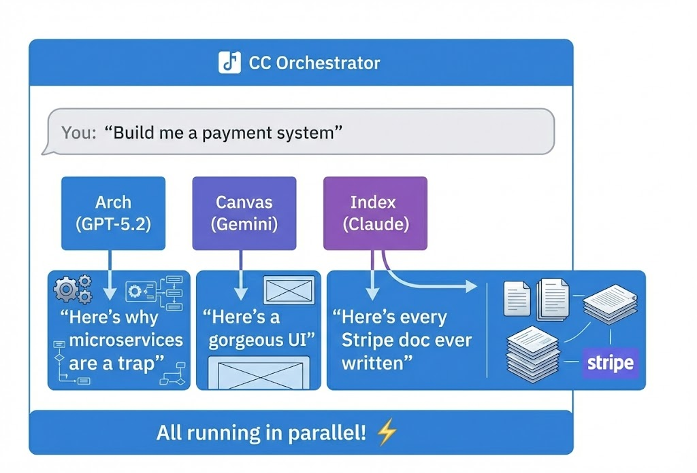

# CC Orchestrator

[](https://opensource.org/licenses/MIT)
[](https://www.npmjs.com/package/cc-orchestrator)

**[한국어 문서 (Korean)](./README.ko.md)**

> _"Why use one AI when you can summon an entire orchestra and make them fight over your code?"_

**CC Orchestrator** transforms Claude Code into a maestro conducting a symphony of AI models. GPT-5.2 argues about architecture, Gemini obsesses over pixels, and Claude dives into documentation rabbit holes. All at the same time. Because waiting is for people who enjoy watching loading spinners.

---

## 🎭 The Pitch

Picture this: You need to build something complex. Traditionally, you'd ask one AI to be an architect, designer, researcher, and writer all at once. That's like asking your dentist to also fix your car.

**CC Orchestrator** says: _"What if we just... hired specialists?"_

<p align="center">
  
</p>

Inspired by [Oh My OpenCode](https://github.com/code-yeongyu/oh-my-opencode). We stole the idea and made it work with Claude Code. Innovation!

---

## ✨ Features (The Good Stuff)

### 🎯 Specialized Agents

Each agent has exactly one job. They're very good at it. They will not shut up about it.

**🏠 Native Agents (FREE - Live in `.claude/agents/`):**

| Agent     | Model              | Personality                                                                                                 |
| --------- | ------------------ | ----------------------------------------------------------------------------------------------------------- |
| **Scout** | Haiku              | 🔍 The speedster. Finds files faster than you can say "where did I put that". 75% cheaper than alternatives |
| **Index** | Sonnet + WebSearch | 📚 The librarian. Reads every doc, cites every source. Uses WebSearch so it's actually up to date           |

**🌐 MCP Agents (External APIs):**

| Agent      | Model        | Personality                                                                                                                   |
| ---------- | ------------ | ----------------------------------------------------------------------------------------------------------------------------- |
| **Arch**   | GPT-5.2      | 🧠 The overthinker. Will write 3 pages about why your variable name is "technically correct but philosophically questionable" |
| **Canvas** | Gemini 3 Pro | 🎨 The artist. Believes every button deserves a 47ms cubic-bezier transition                                                  |
| **Quill**  | Gemini 3 Pro | ✍️ The poet. Writes README files so beautiful they make developers cry                                                        |
| **Lens**   | Gemini 3 Pro | 👁️ The detective. Stares at your screenshots and PDFs until they confess their secrets                                        |

### ⚡ Parallel Execution

Why do things one at a time like some kind of single-threaded peasant?

```text
The old way:    Task A → Task B → Task C    (3 hours of your life, gone)

The new way:    Task A ─┐
                Task B ─┼→ Done!            (They raced. Everyone won)
                Task C ─┘
```

### 🔄 Fallback System (The Safety Net)

APIs go down. It happens. We're prepared.

```text
You: "Arch, review this code"
Arch: *tries to call GPT-5.2*
OpenAI: "lol no" (503)
CC Orchestrator: "Fine, Claude can do it"
Claude: "I was literally made for this"
```

Automatic cross-provider fallbacks. Your work continues. Your deadline survives.

### 🛡️ Circuit Breaker (The Safety Net Upgrade)

APIs go down. It happens. We're prepared. Now we're **REALLY** prepared.

```text
OLD: Retry until the heat death of the universe
NEW: "Provider's down? Cool. Moving on." (automatic, instant)
```

**How it works**:

- Detects cascading failures before your wallet does (5 errors = circuit opens)
- Automatic recovery attempts (we're optimists, after 60 seconds)
- Fast-fail when there's no hope (we're also realists)

**State Machine** (because everything needs a state machine):

```text
CLOSED (normal)
  → 5 failures →
OPEN (blocked, all requests rejected)
  → 60s cooldown →
HALF_OPEN (testing, 1 request allowed)
  → success → CLOSED ✅
  → failure → OPEN ❌ (back to timeout)
```

**What you get**:

- No more thundering herd when APIs recover
- Prevents burning money on doomed requests
- Metrics for debugging ("Why is Arch down AGAIN?")

### 🎹 Trigger Keywords

Talk to your agents naturally. They're listening. (Not in a creepy way.)

**Summon the whole squad:**
| Say this... | What happens |
|-------------|--------------|
| `@all` | Everyone gets to work. Chaos ensues (productively) |
| `@team` | Same energy, different vibe |
| `parallel` | You want speed. We respect that |
| `simultaneously` | For when you feel fancy |
| `together` | Teamwork makes the dream work |

**Call an MCP agent:**

| Mention                                           | Who answers             |
| ------------------------------------------------- | ----------------------- |
| `@arch` or `@architect`                           | The overthinker arrives |
| `@canvas`, `@ui`, `@frontend`, `@ux`, `@designer` | The pixel perfectionist |
| `@quill`, `@docs`, `@writer`                      | The prose professional  |
| `@lens`, `@image`, `@pdf`, `@analyzer`            | The visual investigator |

**Native agents (use Claude Code's Task tool):**

| Command                       | Who answers                                           |
| ----------------------------- | ----------------------------------------------------- |
| `Task(subagent_type="scout")` | 🔍 The speedy scout - finds files and code            |
| `Task(subagent_type="index")` | 📚 The documentation hoarder - searches external docs |

---

## 🚀 Installation

### The Easy Way (For Humans)

```bash
npx cc-orchestrator@latest
```

That's it. The installer will:

- ✅ Ask you politely for API keys
- ✅ Configure everything automagically
- ✅ Not judge your messy home directory

**Installer Options:**

| Option            | Description                    |
| ----------------- | ------------------------------ |
| `--upgrade`, `-u` | Update existing installation   |
| `--force`, `-f`   | Force reinstall all components |
| `--keys`, `-k`    | Reconfigure API keys only      |
| `--help`, `-h`    | Show help message              |

```bash
# Examples
npx cc-orchestrator@latest --upgrade    # Update to latest version
npx cc-orchestrator@latest --keys       # Change API keys
npx cc-orchestrator@latest --force      # Full reinstall
```

### The Hard Way (For Claude Code)

When Claude Code is doing this autonomously (hello, robot friend):

```bash
# 1. Clone it
git clone https://github.com/zhsks311/cc-orchestrator.git
cd cc-orchestrator

# 2. Install the things
npm install

# 3. Create secrets file
cat > .env << 'EOF'
# Add at least one. More is better. All three is showing off.
OPENAI_API_KEY=sk-...
GOOGLE_API_KEY=AIza...
ANTHROPIC_API_KEY=sk-ant-...

# For the patient among us
CCO_TIMEOUT_SECONDS=300
EOF

# 4. Build it
npm run build

# 5. Tell Claude Code about it
```

Add to `~/.claude.json` (Claude Code global config):

```json
{
  "mcpServers": {
    "cc-orchestrator": {
      "type": "stdio",
      "command": "node",
      "args": ["/absolute/path/to/cc-orchestrator/dist/index.js"],
      "env": {
        "OPENAI_API_KEY": "sk-...",
        "GOOGLE_API_KEY": "AIza...",
        "ANTHROPIC_API_KEY": "sk-ant-..."
      }
    }
  }
}
```

```bash
# 6. Optional: Install the fancy extras
cp -r hooks/* ~/.claude/hooks/
cp -r skills/* ~/.claude/skills/

# 7. Restart Claude Code and feel powerful
```

---

## 🎮 Usage

### Multi-Agent Orchestration

The main entry point. Let Claude Code coordinate multiple AI agents for complex tasks.

```bash
/orchestrate Implement user authentication with JWT
```

The orchestrator will:

1. Analyze your request and break it into steps
2. Select the best agent for each step (arch, canvas, index, etc.)
3. Run agents in parallel when possible
4. Collect and integrate results

### Single Agent Usage

For simpler tasks that only need one specialist.

**Native Agents (FREE)** - Runs on your Claude Code quota:

```bash
# Codebase exploration with Scout (Haiku)
"Use scout agent to find all authentication-related files"

# External research with Index (Sonnet + WebSearch)
"Use index agent to find Express middleware best practices"
```

**MCP Agents (External APIs)** - Requires API keys:

```bash
# Architecture review with Arch (GPT-5.2)
"Use arch agent to review this payment system architecture"

# UI/UX design with Canvas (Gemini)
"Use canvas agent to design a login page component"

# Documentation with Quill (Gemini)
"Use quill agent to write API docs for this module"

# Image analysis with Lens (Gemini)
"Use lens agent to analyze this wireframe screenshot"
```

### Other Skills

**UI Quality Assurance:**

```bash
/ui-qa                              # Auto-detect dev server
/ui-qa http://localhost:3000        # Test specific URL
```

Takes screenshots, analyzes with AI, reports visual issues, accessibility problems, and layout bugs.

**Context Checkpoint:**

```bash
/checkpoint "Auth system done, JWT approach chosen"
```

Saves your conversation context. Survives `/compact`. Because losing context hurts.

### Direct Tool Calls (For Control Freaks)

```javascript
// Launch an agent into the void
background_task({ agent: 'arch', prompt: 'Judge my life choices (the code ones)' });

// Check if they're still thinking
background_output({ task_id: 'abc123', block: false });

// Demand answers
background_output({ task_id: 'abc123', block: true });

// Cancel when you've had enough
background_cancel({ task_id: 'abc123' }); // Cancel one
background_cancel({ all: true }); // Cancel everything

// List all tasks
list_tasks({ filter: { status: ['running'] } });

// Share context between agents
share_context({ key: 'api_research', value: { findings: '...' } });
get_context({ key: 'api_research' });

// Get agent recommendation
suggest_agent({ query: 'I need to review this architecture' });
```

### AST-Powered Code Search (The Smart Way)

Forget grep. Search code by structure, not text.

```javascript
// Find all console.log calls
ast_search({ pattern: 'console.log($MSG)', path: './src' });

// Find all function declarations
ast_search({ pattern: 'function $NAME($$$ARGS) { $$$BODY }', path: './src' });

// Find all if statements
ast_search({ pattern: 'if ($COND) { $$$BODY }', path: './src' });

// Replace var with const (preview first)
ast_replace({
  pattern: 'var $NAME = $VAL',
  replacement: 'const $NAME = $VAL',
  path: './src',
  dry_run: true,
});
```

Supports TypeScript, JavaScript, Python, Rust, Go, Java, and more.

---

## 💡 Pro Tips

### 1. Native Agents Are Free. Abuse This.

The `scout` and `index` agents live in `.claude/agents/` and use your Claude Code quota. Zero extra API cost.

```bash
"Use scout agent to find all authentication files"
"Use index agent to find JWT best practices"
```

Perfect for:

- "Where the heck is that file?" → `scout`
- "How do I use this library?" → `index`
- "Show me the project structure" → `scout`

### 2. Arch Is Expensive. Use Wisely.

GPT-5.2 bills by the existential crisis. Save it for:

- Architecture decisions you'll regret later anyway
- Security reviews that make you lose sleep
- When you've tried fixing a bug 3 times and it's personal now

### 3. Parallelize Everything

Instead of this:

```text
"Research the API, then design the component, then review it"
```

Try this:

```text
"Use scout to find existing patterns"     // FREE (Haiku)
"Use index to find Stripe docs"         // FREE (WebSearch)
background_task(arch, "Review security...")  // GPT-5.2
```

Native + MCP agents. Running in parallel. Maximum efficiency.

---

## 🔧 Configuration

### Provider Priority

Customize who gets called first in `~/.cco/config.json`:

```json
{
  "providers": {
    "priority": ["anthropic", "google", "openai"]
  },
  "roles": {
    "arch": {
      "providers": ["openai", "anthropic"]
    }
  }
}
```

### Environment Variables

```bash
# "Call Anthropic first, then Google, then OpenAI"
export CCO_PROVIDER_PRIORITY=anthropic,google,openai

# "Arch specifically should try OpenAI, then Anthropic"
export CCO_ARCH_PROVIDERS=openai,anthropic

# "I have patience" (timeout in seconds)
export CCO_TIMEOUT_SECONDS=300

# Circuit Breaker Settings (NEW!)
# How many failures before we give up on a provider (default: 5)
export CCO_CIRCUIT_FAILURE_THRESHOLD=5

# How long to wait before trying again (milliseconds, default: 60000)
export CCO_CIRCUIT_RESET_TIMEOUT=60000
```

---

## 📦 Project Structure

```text
cc-orchestrator/
├── .claude/                # Claude Code native config
│   └── agents/             # Native agents (FREE, no API calls)
│       ├── scout.md     # Codebase exploration (Haiku)
│       └── index.md   # External research (WebSearch)
├── src/                    # The TypeScript jungle
│   ├── core/               # Business logic (MCP-free zone)
│   │   ├── agents/         # MCP agent definitions
│   │   ├── models/         # Model routing & provider wrangling
│   │   ├── ast/            # AST search/replace engine
│   │   ├── context/        # Context sharing between agents
│   │   └── orchestration/  # The conductor's baton
│   ├── server/             # MCP protocol stuff
│   └── types/              # Types. So many types.
├── hooks/                  # Python automation (spicy)
│   ├── context_resilience/ # Context recovery system
│   ├── adapters/           # Multi-model adapters (Gemini, Copilot, etc.)
│   └── prompts/            # Prompt templates
├── skills/                 # Claude Code skills (extra spicy)
└── scripts/                # Setup scripts (mild)
```

---

## 🪝 Hooks System

Automation that runs behind the scenes. Like a helpful ghost.

| Hook                  | What it does                                                   |
| --------------------- | -------------------------------------------------------------- |
| `context_resilience`  | Auto-recovers context after `/compact`. Your memory, preserved |
| `todo_enforcer`       | Reminds you (aggressively) to use the todo list                |
| `review_orchestrator` | Coordinates multi-model code reviews                           |
| `quota_monitor`       | Tracks API usage before your wallet cries                      |

Hooks live in `~/.claude/hooks/` after installation.

---

## 🧰 Full Tool Reference

| Tool                | Description                          |
| ------------------- | ------------------------------------ |
| `background_task`   | Launch agent in background           |
| `background_output` | Get task status/results              |
| `background_cancel` | Cancel running tasks                 |
| `list_tasks`        | List all tasks in session            |
| `share_context`     | Share data between agents            |
| `get_context`       | Retrieve shared data                 |
| `suggest_agent`     | Get agent recommendation for a query |
| `ast_search`        | Search code by AST pattern           |
| `ast_replace`       | Replace code by AST pattern          |

---

## 🗑️ Uninstallation

Changed your mind? No hard feelings.

```bash
npm run uninstall
```

Options:

1. **Everything** — Nuclear option. Gone.
2. **Local only** — Keep Claude config, delete project files
3. **Claude config only** — Keep project, remove from Claude

---

## 🐛 Troubleshooting

| Problem           | Cause                      | Solution                                         |
| ----------------- | -------------------------- | ------------------------------------------------ |
| MCP won't connect | Someone used `console.log` | Find it. Delete it. Never speak of this.         |
| Agent stuck       | API being dramatic         | Check your keys. Check their status page. Curse. |
| Timeout           | Model is "thinking"        | Increase `CCO_TIMEOUT_SECONDS`. Get coffee.      |
| No response       | You broke it               | `LOG_LEVEL=debug npm run dev`, then panic        |

---

## 🙏 Credits

- [Oh My OpenCode](https://github.com/code-yeongyu/oh-my-opencode) — We borrowed generously from their genius
- [Model Context Protocol](https://modelcontextprotocol.io/) — Making this chaos possible
- [Claude Code](https://claude.ai/claude-code) — The stage for our little orchestra

---

## 📄 License

MIT — Do whatever you want. We're not your parents.

---

<p align="center">
  <i>Stop asking one AI to be everything.<br>Start conducting an orchestra.<br><br>🎼 May your builds be fast and your agents cooperative. 🎼</i>
</p>
